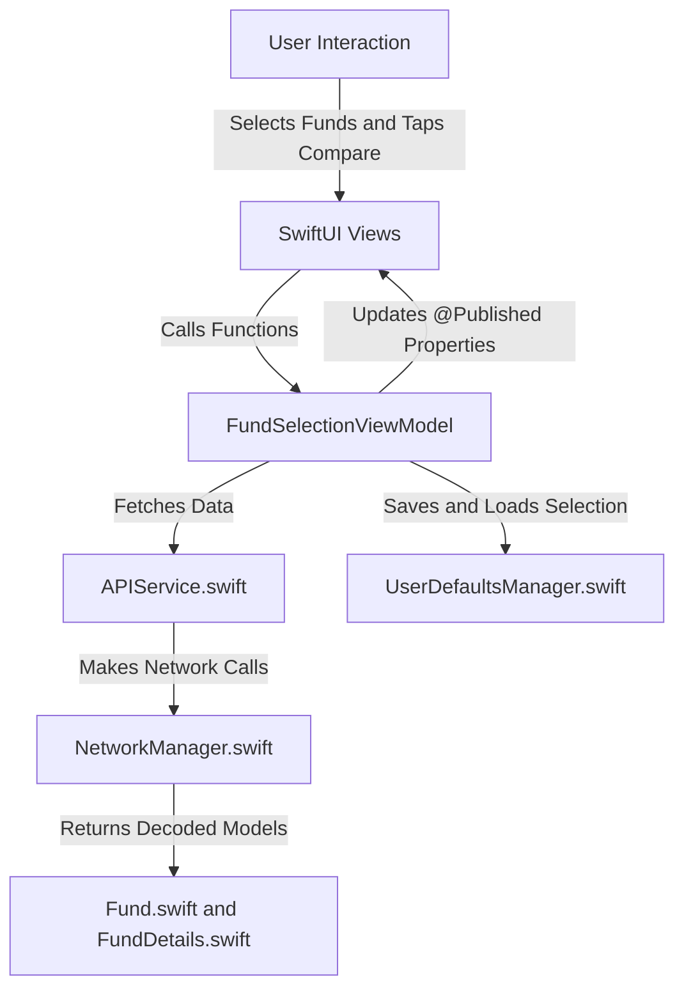
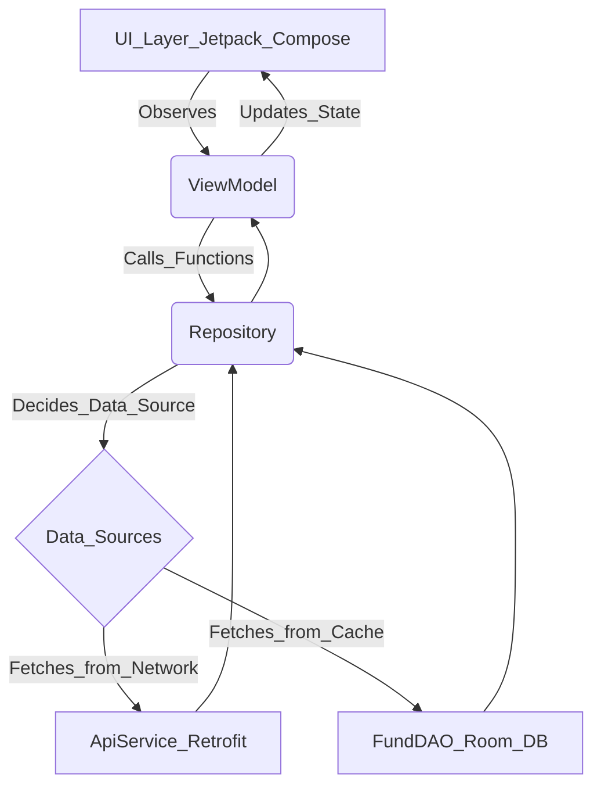

# RabbitInvest iOS App 🐰


RabbitInvest is a modern iOS application built with SwiftUI that allows users to browse, select, and compare the performance of various mutual funds. It features interactive charts for visual data analysis and a clean, reactive user interface.

---

## ✨ Key Features

- **Browse Mutual Funds:** View a comprehensive list of available funds fetched from a live API.
- **Multi-Fund Selection:** Select multiple funds to compare their performance side-by-side.
- **Interactive Comparison Charts:** Visualize the Net Asset Value (NAV) history of selected funds on an interactive line chart.
- **Persistent Selection:** Your fund choices are saved between app launches for convenience.
- **Reactive UI:** Built entirely with SwiftUI and Combine for a smooth and modern user experience.

---

## 🖼️ Screenshots

Here are some screenshots showcasing the app interface and key features:

|  |  |  |
|:--------------------------------------------------------------------------------------------:|:------------------------------------------------------------------------------------------:|:--------------------------------------------------------------------------------------------:|

|  |  |  |
|:-------------------------------------------------------------------------------------------:|:------------------------------------------------------------------------------------------:|:--------------------------------------------------------------------------------------------:|

---
## 🛠️ Tech Stack & Architecture (iOS)

- **UI:** SwiftUI
- **State Management:** Combine Framework for reactive data flow.
- **Charts:** Swift Charts for native and interactive data visualization.
- **Networking:** Native `URLSession` with Combine publishers.
- **Persistence:** `UserDefaults` for lightweight storage of user selections.
- **Architecture:** Model-View-ViewModel (MVVM) to ensure a clean separation of concerns.

---

## 🏗️ Architecture Summary

The application follows the Model-View-ViewModel (MVVM) pattern to cleanly separate concerns, improve maintainability, and ensure reactive UI updates.

| Layer       | Example in Code                      | Responsibility                                |
|-------------|------------------------------------|-----------------------------------------------|
| Model       | `FundDetailsResponse`, `FundMeta`  | Data representation and parsing                |
| ViewModel   | `ComparisonViewModel`               | Business logic, API calls, state management    |
| View        | `ComparisonScreen`                  | UI rendering and user interaction              |
| Service     | `APIService`, `NetworkManager`     | Networking, API request handling                |

---

## 🏗️ Architecture Overview (iOS)



### Key Design Choices

- **Declarative & Reactive:** Using SwiftUI and Combine creates a declarative and reactive system where the UI automatically updates in response to state changes.
- **Native Charting:** Swift Charts is used for its deep integration with SwiftUI, providing powerful and interactive visualizations with minimal code.
- **Efficient Networking:** A centralized APIService and NetworkManager handle all API communications, decoding JSON responses into strongly-typed Codable models.
- **Lightweight Persistence:** UserDefaults is used for simplicity to store the user's fund selections across sessions.

---

## ⚙️ Setup Instructions

To run this project locally, follow these steps:

1. **Clone the repository:**
   ```bash
   git clone https://github.com/saransh0111/AssignmentIOS.git
   ```

2. **Open the project:**
   - Navigate to the cloned directory and open `RabbitInvest.xcodeproj` in Xcode 15 or newer.

3. **Run the app:**
   - Select an iOS 17+ simulator (e.g., iPhone 15 Pro) or a physical device and press the “Run” button.

> **Note:** No external dependencies or package managers are required. All frameworks used are native to the iOS SDK.

---

## 🚀 Future Enhancements

- **Efficient Data Loading:** Implement local caching (e.g., Core Data, SwiftData) and pagination to handle a larger dataset of funds more efficiently.
- **Filtering:** Add server-side filtering support by passing filter IDs (such as acm or scheme_category) as query parameters, so that only relevant funds are returned directly from the backend.
- **Enhanced Charts:** Add more chart interactivity like pinch-to-zoom, date range selection, and tooltips for specific data points.
- **User Accounts:** Introduce user authentication to sync favorite funds across devices.
- **Test Coverage:** Add Unit and UI tests to ensure code reliability and prevent regressions.

---

## 🤖 Proposed Android Version Architecture

An Android version would be built using modern Android architecture components, ensuring a robust, scalable, and testable application.

- **UI Layer:** Jetpack Compose for building a declarative UI, similar to SwiftUI.
- **ViewModel:** AndroidX ViewModel to hold and manage UI-related data.
- **State Management:** LiveData or StateFlow to expose data streams from the ViewModel to the UI.
- **Data Layer:** Repository Pattern to abstract data sources.
- **Networking:** Retrofit & OkHttp for efficient and type-safe API calls.
- **Local Caching:** Room Database for offline support and caching.
- **Asynchronous Operations:** Kotlin Coroutines for managing background threads.

---

### Detailed Data Flow



#### Example: Fetching Fund List

1. **View (Composable Function):** When the screen is first displayed, it triggers an event in the ViewModel (e.g., `viewModel.loadFunds()`). The Composable observes a LiveData or collects a StateFlow (e.g., `viewModel.fundList`) to listen for updates.
2. **ViewModel:** The `loadFunds()` function in the ViewModel launches a coroutine and calls the Repository (e.g., `repository.getFunds()`). It does not know or care if the data comes from the network or a local database.
3. **Repository:** The `getFunds()` function in the Repository contains the business logic. It might first try to fetch funds from the Room database. If the cache is empty or stale, it will then trigger a network call using the ApiService (Retrofit). Once the data is fetched, it saves the fresh data to the Room database for future use and then returns the data.
4. **Data Propagation:** The data flows back to the ViewModel, which updates its LiveData or StateFlow property (e.g., `_fundList.value = newFunds`).
5. **UI Update:** Because the Composable is observing this state, it automatically recomposes (re-renders) itself to display the list of funds, ensuring the UI is always in sync with the application's data.

---

## 📂 Repository

[https://github.com/saransh0111/AssignmentIOS](https://github.com/saransh0111/AssignmentIOS)
